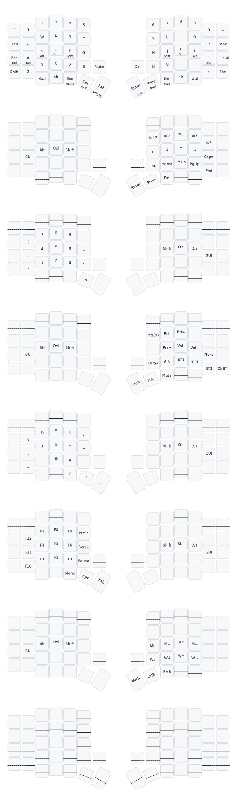

# sofle-rmk

[RMK](https://github.com/HaoboGu/rmk) (Rust) firmware for the **PandaKB Sofle** —
nice!nano (nRF52840), BLE split, rotary encoders, SSD1306 OLEDs, battery
reporting, Vial.

Ported from my ZMK config ([dieselsaurav/zmk-for-sofle](https://github.com/dieselsaurav/zmk-for-sofle)).
Schema, OLED renderers and the vendored BLE patch adapted from
yuyudhan-rmk-config; original scaffold reference: jakoritarleite/sofle-rmk.

## Layout

Miryoku-style: QWERTY base with GACS home row mods, 7 typing layers
(BASE / NAV / NUM / MEDIA / SYM / FUN / MOUSE) + a DISPOFF layer that blanks
the OLEDs (TG(7) on MEDIA), 14 combos (caps word on F+J, vertical symbol
combos, ...), encoders (volume | page scroll). Left half = central.



Regenerate after keymap changes (needs `keymap-drawer` on PATH):

```sh
python3 scripts/keymap_docs.py svg  --toml config/keyboard.toml --out sofle-rmk_keymap.svg
python3 scripts/keymap_docs.py html --toml config/keyboard.toml --out sofle-rmk-viewer.html
```

Keymap lives in `config/keyboard.toml` (compile-time) and is editable live
with [Vial](https://vial.rocks) — unlock by holding the two inner left thumb
keys. BLE keys on MEDIA: User0-3 = profile BT0-BT3, User6 = clear bond,
User7 = toggle USB/BLE output.

## Patched RMK (vendor/)

`vendor/rmk` is upstream RMK at rev `b982049`, pristine except for the
**per-profile whitelist-advertising patch** (see `vendor/rmk/YUYUDHAN_PATCH.md`):

- a bonded profile advertises *filtered* — other computers can't steal the
  connection slot and wedge the keyboard on the wrong LTK;
- filtered advertising is gated on split-link health, so the right half can
  always reconnect (stock accept-list contention starves the split link).

Wired via `[patch."https://github.com/HaoboGu/rmk"]` in `Cargo.toml`.

## Displays

- **Left (central):** layer name, WPM, BLE profile, connection state,
  battery gauge, firmware version (from `VERSION`). Event-driven — zero idle cost.
- **Right (peripheral):** split-link ✓/✗, WPM equalizer, caps badge, battery.

Mounted portrait; if content is upside-down flip `rotation = 90` → `270`.

## Building

Cloud: push to GitHub — CI uploads `rmk-central.uf2` / `rmk-peripheral.uf2`.

Local:

```sh
rustup target add thumbv7em-none-eabihf
cargo install cargo-make
cargo make uf2          # outputs build/rmk-{central,peripheral}.uf2
```

## Flashing

1. Double-tap reset on the **left** half → drag `rmk-central.uf2` onto the `NICENANO` drive.
2. Same on the **right** half with `rmk-peripheral.uf2`.

Reflash the **central** for keymap changes; the peripheral only needs
reflashing when firmware code changes.

## ⚠️ Going back to ZMK

RMK ≥ 0.7 replaces the Nordic SoftDevice BLE stack. **To return to ZMK you
must first re-flash the
[nice!nano bootloader](https://nicekeyboards.com/docs/nice-nano/troubleshooting#my-nicenano-seems-to-be-acting-up-and-i-want-to-re-flash-the-bootloader)**,
then flash ZMK as usual.

## Not ported (RMK gaps)

- **RGB underglow** — RMK lighting support is still maturing; ZMK `rgb_ug` keys dropped.
- **nice!view** — unsupported; this port drives the stock SSD1306 OLEDs. With
  nice!views fitted the keyboard works but screens stay blank.
- **`ext_power` toggle, ZMK-style deep sleep** — not yet in RMK.
